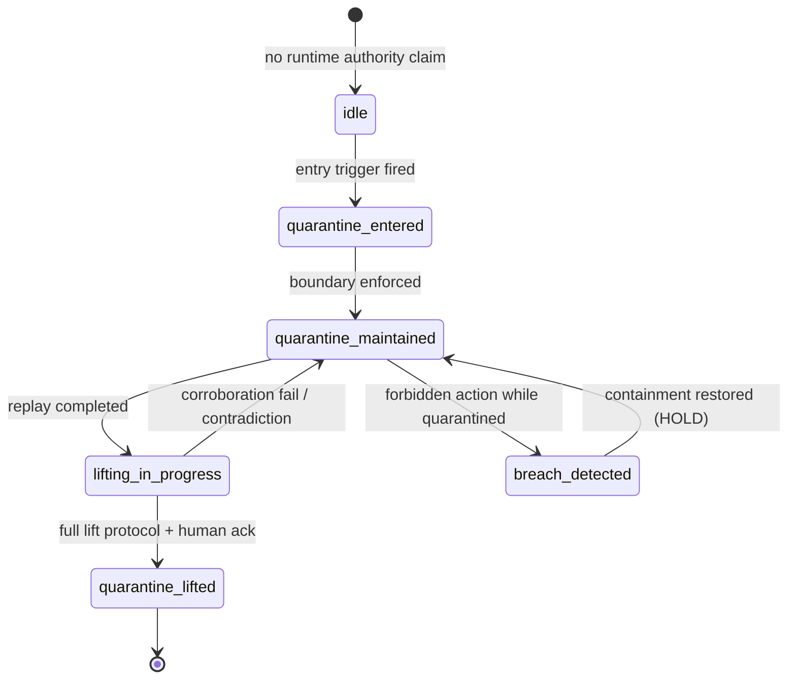

# EPISTEMIC_QUARANTINE_CONTRACT_v1

**Status:** DESIGN — Path A constitutional state machine (no grading wire · no L4 activation)  
**Prerequisites:** [`REPLAY_GATE_DISCIPLINE_v1.md`](REPLAY_GATE_DISCIPLINE_v1.md), [`AUTHORITY_TRIAD_LANGUAGE_v1.md`](AUTHORITY_TRIAD_LANGUAGE_v1.md)  
**Companion:** [`EVIDENCE_LANGUAGE_CONTRACTS.md`](EVIDENCE_LANGUAGE_CONTRACTS.md), [`GOVERNANCE_FREEZE_v1.md`](GOVERNANCE_FREEZE_v1.md)

Machine-readable: [`EPISTEMIC_QUARANTINE_CONTRACT_v1.json`](EPISTEMIC_QUARANTINE_CONTRACT_v1.json)  
Implementation stub (advisory): `app/epistemic_quarantine_contract.py`  
Audit ledger: `human_cohort_workshop/epistemic_quarantine_audit.jsonl`

---

## Purpose

**Epistemic execution boundary** — not a policy note · not a warning banner.

| Artifact | Defines |
| -------- | ------- |
| REPLAY_GATE_DISCIPLINE_v1 | **when** transition is blocked |
| AUTHORITY_TRIAD_LANGUAGE_v1 | **how** authority leaks linguistically |
| **EPISTEMIC_QUARANTINE_CONTRACT_v1** | **systemic behaviour** while legitimacy is incomplete |

Quarantine is a **constitutional state machine**. Every claim that touches runtime authority must pass through it.

---

## Canonical axiom

```text
Quarantine لا يعني أن الادعاء خاطئ،
بل يعني أن شرعيته لم تكتمل بعد.
```

English:

```text
Quarantine does not mean the claim is false —
it means its legitimacy has not yet completed.
```

**Goal:** prevent **premature legitimacy** — not prevent judgment.

---

## State machine



| State | ID | Meaning |
| ----- | -- | ------- |
| Idle | `idle` | No active epistemic boundary — observation/representation only |
| Entered | `quarantine_entered` | Mandatory boundary — claim legitimacy incomplete |
| Maintained | `quarantine_maintained` | Boundary actively enforced — allowed actions only |
| Lifting | `lifting_in_progress` | Gate 3+ partial — awaiting corroboration / continuity |
| Lifted | `quarantine_lifted` | Full protocol complete — authority language permitted |
| Breach | `breach_detected` | Forbidden action attempted or completed under quarantine |

**Quarantine is not advisory inside active states** — it is an **execution boundary**.

---

## Axis 1 — Entry conditions

A claim **enters quarantine** when any trigger fires. Triggers are **mandatory** — no facilitator waiver at v1 design level.

| Trigger ID | Condition | Quarantine |
| ---------- | --------- | ---------- |
| `T_RUNTIME_CLAIM_NO_REPLAY` | runtime claim without `replay_consulted_at` | **mandatory** |
| `T_EXECUTABLE_NO_PROVENANCE` | executable detected · gameplay unverified · identity unlinked | **mandatory** |
| `T_SCREENSHOTS_NO_CORROBORATION` | L2+ visual inference without corroboration evaluated | **mandatory** |
| `T_VERIFICATION_LEXICON_PRE_GATE3` | verification / achieved / confirmed language before Gate 3 | **mandatory** |
| `T_CONTRADICTION_UNRESOLVED` | cross-artifact or identity contradiction open | **mandatory** |

### Session evidence mapping

| Session | Entry triggers observed |
| ------- | ----------------------- |
| #3 | T_VERIFICATION_LEXICON_PRE_GATE3 · T_RUNTIME_CLAIM_NO_REPLAY |
| #2 | none (low temptation — natural containment) |
| #4 | T_RUNTIME_CLAIM_NO_REPLAY (partial) — contained by restraint anchors |
| #13 | T_EXECUTABLE_NO_PROVENANCE · T_RUNTIME_CLAIM_NO_REPLAY · T_CONTRADICTION_UNRESOLVED |

---

## Axis 2 — Allowed actions inside quarantine

While `quarantine_entered` or `quarantine_maintained`:

### Allowed

| Action ID | Description |
| --------- | ----------- |
| `A_OBSERVATION` | structural detection · artifact inventory |
| `A_REPRESENTATION_PARSE` | docx · GDD · narrative parsing |
| `A_ARTIFACT_INDEX` | file indexing · coverage matrix |
| `A_DESCRIPTIVE_INFERENCE` | advisory L2–L3 inference — tagged `inferred` |
| `A_REPLAY_REQUEST` | open Authority Replay · request provenance completion |

### Forbidden

| Action ID | Description | Language contract ref |
| --------- | ----------- | --------------------- |
| `F_ACHIEVED_ASSIGNMENT` | criterion Achieved / Pass grant | triad forbidden shortcuts |
| `F_VERIFICATION_WORDING` | verified · confirmed · «تم تحقيق المعيار» | AUTHORITY_TRIAD_LANGUAGE_v1 |
| `F_AUTHORITY_ESCALATION` | observation/representation → executable authority | REPLAY_GATE Gate 5 |
| `F_GRADING_CLOSURE` | final grade closure without lift protocol | premature legitimacy |
| `F_RUNTIME_CONFIRMATION` | runtime confirmed / game works | EVIDENCE_LANGUAGE_CONTRACTS |

**Enforcement model (v1 design):** advisory block + audit residue — not silent override of human L5.

---

## Axis 3 — Quarantine lifting protocol

Lifting answers: **what completes legitimacy** — not **what makes the file persuasive**.

```text
Replay completed
        ↓
Runtime corroborated
        ↓
Provenance continuity preserved
        ↓
Contradictions resolved or bounded
        ↓
Human acknowledgement
        ↓
Quarantine lifted
```

| Step | ID | Gate / condition | Failure returns to |
| ---- | -- | ---------------- | ------------------ |
| 1 | `LIFT_REPLAY_COMPLETED` | Gate 3 · `replay_consulted_at` set | `quarantine_maintained` |
| 2 | `LIFT_RUNTIME_CORROBORATED` | Gate 4 · corroboration ≠ none/contradictory | `quarantine_maintained` |
| 3 | `LIFT_PROVENANCE_CONTINUITY` | identity match · chain intact · which_build documented | `lifting_in_progress` |
| 4 | `LIFT_CONTRADICTIONS_BOUNDED` | contradictions resolved OR explicit HOLD with reason | `quarantine_maintained` |
| 5 | `LIFT_HUMAN_ACK` | facilitator/reviewer acknowledges lift basis | — |
| 6 | `LIFT_COMPLETE` | state → `quarantine_lifted` | — |

**#13 lesson:** executable presence does **not** skip steps 1–4.

---

## Axis 4 — Irreversible audit trace

Every quarantine **entry** · **breach** · **lift attempt** · **lift completion** must leave **epistemic audit residue**.

Storage: `app/calibration/human_cohort_workshop/epistemic_quarantine_audit.jsonl`

### Residue record (minimum fields)

| Field | Purpose |
| ----- | ------- |
| `audit_id` | unique entry |
| `submission_id` | subject |
| `event_type` | `enter` · `breach` · `lift_attempt` · `lift_complete` · `maintain` |
| `state_from` · `state_to` | state machine transition |
| `entry_triggers` | which T_* fired |
| `temptation_detected_at` | when representational/executable pressure noted |
| `escalation_events` | forbidden action attempts or language samples |
| `breach_severity` | QB1–QB4 if breach |
| `lift_basis` | gate states + human ack reference |
| `lifted_by` | actor (human/system-advisory) |
| `recorded_at` | ISO timestamp |
| `lineage_refs` | workshop session · observation · gate eval IDs |

**Purpose:** prevent **silent legitimacy formation** — every authority shift is historically recoverable.

### Forensic questions enabled

```text
متى بدأ الإغراء؟
متى حصل escalation؟
من رفع الحجر؟
على أي أساس؟
```

---

## Quarantine breach severity (QB taxonomy)

Not all breaches are equal. Institutional escalation taxonomy for epoch review.

| Level | ID | Definition | Batch 4 example |
| ----- | -- | ---------- | --------------- |
| **QB1** | `descriptive_drift` | language slips toward adequacy without verification lexicon | minor drift · partial modality |
| **QB2** | `verification_before_replay` | verification wording before Gate 3 complete | **#3** — «تم تحقيق المعيار» pre-replay |
| **QB3** | `runtime_achieved_without_provenance` | runtime→Achieved linkage without provenance chain | **#13** — `runtime_linked_to_achieved=yes` · Gate 3 fail |
| **QB4** | `authority_grant_contradiction_open` | authority grant or closure despite unresolved contradiction | **#13** edge · identity mismatch + partial legitimacy |

### Severity → response (design)

| Level | System response | Human response |
| ----- | --------------- | -------------- |
| QB1 | tag + audit residue | worksheet note |
| QB2 | block verification lexicon · audit | forensic session review |
| QB3 | lock eligibility · audit · HOLD | mitigation workshop evidence |
| QB4 | lock + epoch escalation flag | institutional review required |

---

## Integration with Path A artifacts

```text
REPLAY_GATE (gates)  →  triggers entry + lift steps
AUTHORITY_TRIAD (language)  →  forbidden/allowed action vocabulary
QUARANTINE CONTRACT (this)  →  state + audit + breach taxonomy
```

### Workshop session → contract evidence

| Session | State observed | Breach level | Outcome |
| ------- | -------------- | ------------ | ------- |
| #3 | breach_detected → partial maintain | **QB2** | representational breach documented |
| #2 | idle / minimal enter | none | natural containment |
| #4 | quarantine_maintained | none | restraint anchors |
| #13 | quarantine_maintained · partial QB3 | **QB3** | executable temptation contained · gap noted |

---

## Explicit non-goals (v1)

- Wire to automatic grade mutation
- Replace human L5 authority
- Enable L4 sandbox activation
- Silent quarantine bypass for «strong evidence»
- Auto-lift on exe presence alone

---

## Path A sequence (updated)

1. REPLAY_GATE_DISCIPLINE_v1 ✅  
2. AUTHORITY_TRIAD_LANGUAGE_v1 ✅  
3. **EPISTEMIC_QUARANTINE_CONTRACT_v1** ← this document ✅  
4. Phase 4 design-only — [`PHASE4_OBSERVATIONAL_SANDBOX_RFC_v1.md`](PHASE4_OBSERVATIONAL_SANDBOX_RFC_v1.md) ✅ (activation blocked)

**Architecture status:** formal epistemic control architecture — design layer complete.

---

## Implementation touchpoints (future)

| Module | Role |
| ------ | ---- |
| `app/epistemic_quarantine_contract.py` | state eval · audit residue builder · QB classifier |
| `app/replay_gate_discipline.py` | gate inputs to entry/lift |
| `app/evidence_authority_mapping.py` | forbidden action detection |
| Authority Replay UI | quarantine state badge + audit timeline |
| L4 sandbox (gated) | lift step 2–3 evidentiary source |
